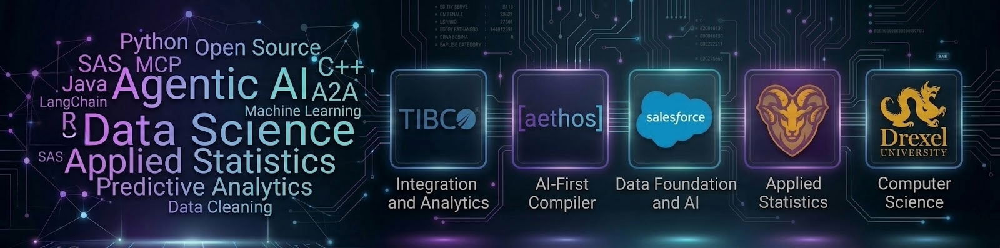

# 👋 Hi there, I'm John Fisher

**Principal Data Foundation Solution Engineer @ Salesforce | Applied Data Science and Statistics | Creator of [aethos]**

I am a technologist and statistician specializing in bridging the gap between complex enterprise architecture and C-level business strategy. With advanced degrees in Computer Science (B.S., M.S.) and Applied Statistics (M.S.), I have a proven track record of mapping complex customer requirements into high-impact solutions. My work spans enterprise pre-sales leadership, rigorous academic research, and deep-in-the-weeds data science, machine learning, and compiler design.

---

### 🚀 What I'm Currently Building

* **[aethos]:** Founder and lead developer of an AI-first programming language and platform. Designed from the ground up to be the best-in-class language for Data Cleaning, Machine Learning, and AI. Currently in the language definition and interpreter testing phase, with a roadmap toward hardware-targeted compilation for compute optimization, advanced memory management and AI/ML optimization. 
* **Academic Research:** Lead Statistician and Data Scientist at the West Chester University Statistical Institute, where I own the analysis end to end: cleaning, modeling, verification, and the write-up for peer-reviewed work in behavioral psychology, nursing, drug addiction therapy and outcomes, and polling analysis. Two of those studies are published here in full, from the SAS that produced the numbers down to the assumption checks most papers leave out. **[Improving Confidence in Managing Patient Aggression](https://github.com/johnfisher-ai/fisher-wpv-aggression-study-sas)** ([read the analysis](https://johnfisher-ai.github.io/fisher-wpv-aggression-study-sas/)) is a pre/post interprofessional simulation study, under review at the *Journal of Interprofessional Education & Practice*: three SAS programs, the executed output, effect sizes and normality tests, and a Python notebook that reproduces all of it. **[Measuring Nursing Students' Acceptance of AI-Enabled Virtual Reality](https://github.com/johnfisher-ai/fisher-measure-ai-nursing-study)** ([read the analysis](https://johnfisher-ai.github.io/fisher-measure-ai-nursing-study/)) does the same for a published VR study. Open either one to see everything that usually sits hidden behind a results table.
* **Agentic AI & ML:** Exploring and building proofs-of-concept utilizing LangChain, LangGraph, Python, R, and SAS. Most recently [a config-driven agent network](https://github.com/johnfisher-ai/fisher-agentic-network-langgraph), where the whole agent roster is data rather than code.
* **Data Science & ML Portfolio:** Public repositories covering statistical testing, survey methods, machine learning and Agentic AI, written in Python, R and SAS. The largest by some distance is **[Statistics, Data Science and AI: A Visual Handbook](https://github.com/johnfisher-ai/Statistics-Data-Science-AI-Visual-Book)** ([read it live](https://johnfisher-ai.github.io/Statistics-Data-Science-AI-Visual-Book/)): 205 chapters and 41 capstone walkthroughs running from what a mean is through to fairness audits and MLOps, each paired with one of 345 runnable Colab notebooks and a real dataset to work on. Released under CC BY 4.0, so you can teach from it, translate it, or lift a chapter for a class.

---

## 📚 Featured Work

**[Statistics, Data Science and AI: A Visual Handbook](https://github.com/johnfisher-ai/Statistics-Data-Science-AI-Visual-Book)** · [Read it live](https://johnfisher-ai.github.io/Statistics-Data-Science-AI-Visual-Book/)

A clickable handbook covering statistics and data science end to end: 205 chapter pages, including 41 capstone walkthroughs, each paired with a runnable notebook that opens in Colab. Written for people who want the explanation and the code in the same place. By John Fisher.

**[A Config-Driven Agent Network](https://github.com/johnfisher-ai/fisher-agentic-network-langgraph)** · [Read the write-up](https://johnfisher-ai.github.io/fisher-agentic-network-langgraph/)

An exploration of LangChain and LangGraph: specialist agents coordinated by a broker, with a human approval gate on anything consequential. The agent roster, the routing prompts and the definition of what counts as risky all live in an XML file rather than in code, so the same graph runs an online travel agency or a management consulting firm with nothing changed but a file path. Four pages covering the design, the architecture and the code, a Colab notebook, and a test suite that runs without an API key. By John Fisher.

**[Improving Confidence in Managing Patient Aggression](https://github.com/johnfisher-ai/fisher-wpv-aggression-study-sas)** · [Read the analysis](https://johnfisher-ai.github.io/fisher-wpv-aggression-study-sas/)

Lead statistician on a quasi-experimental pre/post study of interprofessional simulation training at West Chester University, under review at the *Journal of Interprofessional Education & Practice*. The repository publishes the whole pipeline rather than just the result: three SAS programs, executed output, a full statistical write-up with effect sizes and assumption checks, and a Colab notebook reproducing the analysis in Python. By John Fisher, lead statistician.

**[Measuring undergraduate nursing students' acceptance of AI enabled virtual reality using AI generated simulation](https://github.com/johnfisher-ai/fisher-measure-ai-nursing-study)** · [Read the analysis](https://johnfisher-ai.github.io/fisher-measure-ai-nursing-study/)

Technology acceptance analysis for a published nursing VR study: SAS program, executed output, full statistical write-up, Colab notebook and published study. By John Fisher, lead statistician.

**[Analysis of Psychosocial Treatments for Cocaine Dependence](https://github.com/johnfisher-ai/fisher-analysis-psychosocial-treatments)** · [Read the analysis](https://johnfisher-ai.github.io/fisher-analysis-psychosocial-treatments/)

Statistical analysis of four psychosocial treatments for cocaine dependence, using data from the NIDA Collaborative Cocaine Treatment Study. The repository holds the SAS program, the executed SAS output, the presentation, and a Python notebook that reproduces the models. By John Fisher, lead statistician.

**[Depression and Substance Use in the United States](https://github.com/johnfisher-ai/fisher-nsduh-analysis)** · [Read the analysis](https://johnfisher-ai.github.io/fisher-nsduh-analysis/)

An analysis of the National Survey on Drug Use and Health (NSDUH), 2022 to 2024. Three survey years pooled to 134,897 adults, examining who reports a past-year major depressive episode, which substances travel with it, and what the survey's own design changes about the answer. Write-up, R and Python Notebooks. By John Fisher, lead statistician.

---

### 💼 Professional Experience

**Salesforce** | *Principal Data Foundation Solution Engineer*
* Bridge the gap between complex enterprise architecture, AI, and C-level business strategy.
* Specialize in data foundation technologies, including MuleSoft, Informatica, AI/MCP/A2A, and Agentic frameworks.
* Collaborate closely with sales teams and customers to architect and deliver best-in-class data foundation and Agentic solutions.

**West Chester University Statistical Institute** | *Lead Statistician and Data Scientist*
* Partner with research teams to investigate and publish peer-reviewed articles in behavioral psychology, nursing, drug addiction therapy and outcomes, and polling analysis.
* Lead the end-to-end data lifecycle, focusing on rigorous data cleaning, descriptive and predictive analysis, statistical verification, and the write-up of results.

**TIBCO** | *Director Solution Engineering, Large Accounts*
* Partnered with C-level executives to design and deliver large-scale enterprise data integration and advanced analytic solutions.

---

### 🎓 Education & Academic Research

**Education:**
* **M.S. in Applied Statistics** | *West Chester University* | *Focus: Data Science, Artificial Intelligence*
* **M.S. in Computer Science** | *Drexel University* | *Focus: Compiler Theory and Artificial Intelligence*
* **B.S. in Computer Science** | *Drexel University*

**Statistical Institute** | *Lead Statistician & Data Scientist*
* Partner with research teams to investigate and publish peer-reviewed articles in behavioral psychology, nursing, drug addiction therapy and outcomes, and polling analysis.
* Lead the end-to-end data lifecycle, focusing on rigorous data cleaning, descriptive and predictive analysis, statistical verification, and the write-up of results.

---

### 🛠 Technical Arsenal

**Data Science & AI:**
Machine Learning | Agentic AI | Applied Statistics | Data Cleaning | Descriptive & Predictive Analytics | LangChain/LangGraph | MCP & A2A

**Languages:**
Python | R | SAS | Java | Aethos (Creator)

**Enterprise Architecture & Data:**
Data Virtualization | Master Data Management | Complex Event Processing (CEP) | API Led Architecture | Integration | Cloud Technologies

**Infrastructure & Security:**
Hyper Scalers & Cloud | LDAP | PKI | Identity Management | Windows | Linux

---

### 📫 Let's Connect

* **LinkedIn:** [LinkedIn](https://www.linkedin.com/in/johnrfisher/)
* **Email:** [johnrfisher@gmail.com](mailto:johnrfisher@gmail.com)
* **Reach out for:** Open source collaboration on `aethos`, discussions on Agentic AI, or enterprise data architecture.
